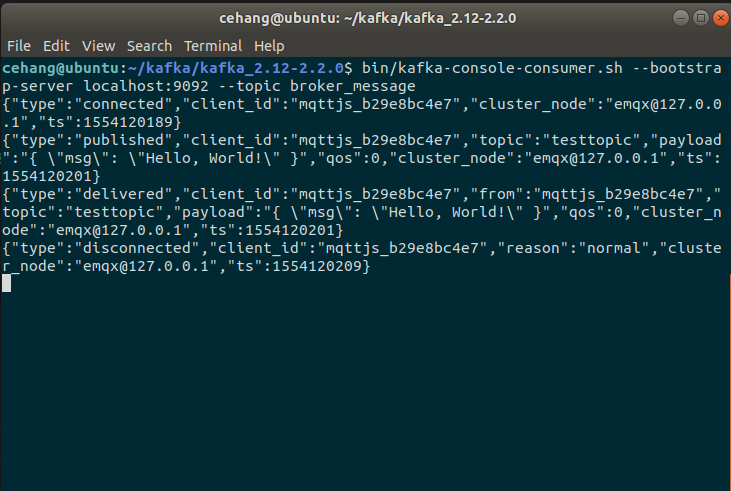

#### **如何对MQTT做数据的存储**

##### **EMQ-kafka桥接插件**

> 参考<https://github.com/msdevanms/emqttd_plugin_kafka_bridge>

###### **ekaf**

​	EMQ-kafka桥接的基本原理是构建一个kafka producer，EMQ工作过程中的数据将存储至该kafka容器中，这是桥接的第一步，即将EMQ数据通过kafka生产者存储起来。[ekaf](https://github.com/helpshift/ekaf)是一个微型、高性能erlang kafka producer，其具体实现源码暂时没有精力去拜读（看不懂），借助ekaf可以帮我们实现桥接的第一步。

​	为此，在插件目录下Makefile中添加依赖：

```makefile
BUILD_DEPS = emqx cuttlefish ekaf
dep_ekaf = git https://github.com/helpshift/ekaf master
```

​	rebar.config中添加ekaf依赖包

```erlang
{deps, [
    {ekaf,   ".*", {git, "https://github.com/helpshift/ekaf.git",  "829453cb26876e4b483c9875a63ff8551ae06c09"}}
]}.
```

###### **基于hook框架的桥接功能实现**

​	分析*emqttd_plugin_kafka_bridge.erl* 源码，主要利用ekaf的API函数以及EMQ动作的回调函数来实现所需的功能。其主要功能函数：

- `ekaf_init`，ekaf包初始化，kafka环境变量的设置

- `ekaf:produce_async_batched`，异步发布kafka消息

- `on_client_connected`等多个EMQ功能回调函数，实现具体功能

  举例`on_message_publish`，首先export勾函数：

  ```erlang
  -export([on_message_publish/2]).
  ```

  在插件load回调中需要初始化ekaf包以及注册勾函数：

  ```erlang
  load(Env) ->
      ekaf_init([Env]),
      %% ......
      emqttd:hook('message.publish', fun ?MODULE:on_message_publish/2, [Env]).
  
  ```

  `on_message_publish`函数中主要是封装json数据并通过`produce_async_batched`发布。

  ```erlang
  on_message_publish(Message, _Env) ->
      io:format("publish ~s~n", [emqttd_message:format(Message)]),   
      From = Message#mqtt_message.from,
      Sender =  Message#mqtt_message.sender,
      Topic = Message#mqtt_message.topic,
      Payload = Message#mqtt_message.payload, 
      QoS = Message#mqtt_message.qos,
      Timestamp = Message#mqtt_message.timestamp,
      Json = mochijson2:encode([
          {type, <<"published">>},
          {client_id, From},
          {topic, Topic},
          {payload, Payload},
          {qos, QoS},
          {cluster_node, node()},
          {ts, emqttd_time:now_to_secs(Timestamp)}
      ]),
  
      ekaf:produce_async_batched(<<"broker_message">>, list_to_binary(Json)),
  
      {ok, Message}.
  ```

  另外，在etc/plugin.config中需要添加kafka相关配置选项，

  ```erlang
  [
    {emqttd_plugin_kafka_bridge, [
    	{kafka, [
        {bootstrap_broker, {"127.0.0.1", 9092} },
        {partition_strategy, strict_round_robin}
      ]}
    ]}
  ].
  ```

  然后进行工程的编译。

- 问题1：提示编译失败找不到头文件，原因是源码中用的是旧版本的EMQTT，现在已经改名为EMQ，更改为对应的路径及名字即可。

- 问题2：未定义的变量名，原因同上，更改为符合EMQX中的定义即可，如：

  ~~#mqtt_message~~  => #message，又如message‘类’中的`sender`成员在EMQ中已经删去了。

  但错误不仅仅这些，我对Erlang语法不太熟悉，所以对照着EMQX里面其他插件进行了许多更多更改直至编译通过。

  ###### **功能测试**

  ~~emmm，kafka消费者好像没收到数据，心态崩了，回头再找原因:(~~

  原因是依赖关系没有设置正确。

  1. 在主目录Makefile中添加：

     ```
     DEPS += emqx_plugin_kafka_bridge
     ```

  2. relx.config中添加kafkamocker，ekaf，{emqx_plugin_kafka_bridge,load}

  3. 找不到mochijson2模块：

     手动添加该模块：

     <https://github.com/mochi/mochiweb/blob/master/src/mochijson2.erl>

     疑惑为什么别人不需要手动添加（erlang自带？），相关的资料太少了一度以为是程序上的问题。

​	测试步骤：开启zookeeper，开启kafka，创建kafka消费者 ，开启EMQ桥接插件，进行连接订阅发布等操作，能够看到在消费者窗口上正确地接收到了数据。

