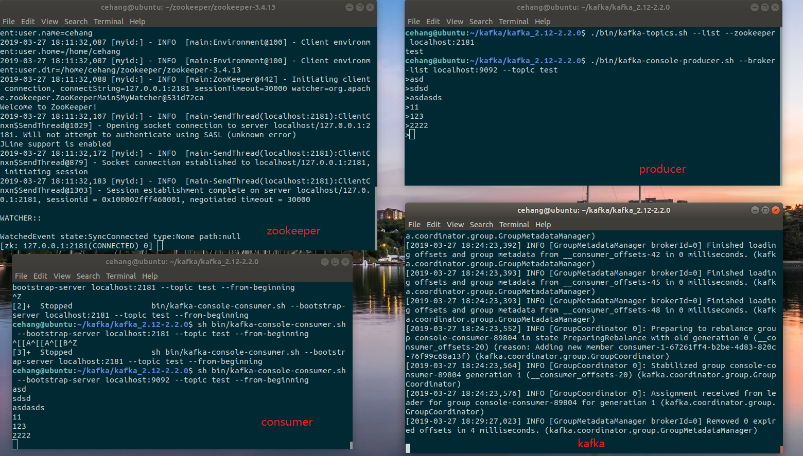

#### 如何对MQTT做数据的存储

​	本地MQTT client成功发布消息到云端Broker后，下一步需要对消息数据进行存储及后续处理，或插入MySQL，目前大致有以下方法：

- 在服务器端添加一个附加客户端，让其订阅所需数据主题，一般通过通配符`#`来实现。该客户端就能够接收代理分发的所需消息，进而执行所需操作。该方法优点是实现简单，缺点是当随着订阅数据的增加，处理压力增大。
- 借助[EMQ](<http://www.emqtt.com/>)的钩子函数与REST API，参考[Learn, How to save MQTT messages into a MySQL Database](<https://www.raviyp.com/embedded/233-learn-how-to-save-mqtt-messages-into-a-mysql-database>)
- 借助EMQ的钩子函数以及一个消息队列中间件[Kafka](http://kafka.apache.org/),通过kafka聚合和采集消息，缓冲到数据仓库中以待后续处理。基于应用框架特点使用此方法作为解决方案。

#### **EMQ-HOOK**	

​	EMQ的一个优点是其优秀的扩展性，用户可以通过模块注册和钩子(Hooks)机制，支持用户开发扩展插件定制服务器认证鉴权与业务功能。

> ​	钩子(Hook) 采用职责链设计模式([Chain-of-responsibility_pattern](https://en.wikipedia.org/wiki/Chain-of-responsibility_pattern))，扩展模块或插件向钩子注册回调函数，系统在客户端上下线、主题订阅或消息发布确认时，触发钩子顺序执行回调函数。EMQ 消息服务器在客户端上下线、主题订阅、消息收发位置设计了扩展钩子(Hook)。

​	由于对Erlang实在过于陌生，其具体实现原理以及使用方法可参考[EMQ官方文档](https://developer.emqx.io/docs/emq/v3/cn/design.html#hook)。

#### **Kafka**

##### **What‘s it**

[	Apache kafka](http://kafka.apache.org/)是一种消息中间件，是目标是实现实时的流处理，采用了生产者消费者模型并可作为集群运行在多个服务器上。更多关于Kafka的介绍参考官方文档或中文教程：http://orchome.com/kafka/index 。

##### **How to use**

​	安装部署参考下面链接：

> ubuntu18.04下Kafka安装与部署 <https://blog.csdn.net/u010889616/article/details/80641922>

​	遇到的问题：

- Kafka自带的zookeeper在我的环境下（ubuntu 18.04）运行不正常，所以需要独立安装zookeeper。

  > 解决方法：

- 建立消费者时报错：``zookeeper is not a recognized option`` ，原因是kafka版本问题。

  > 解决方法：参考<https://www.jianshu.com/p/80a10811d5cb>	

  部署成功如下：

