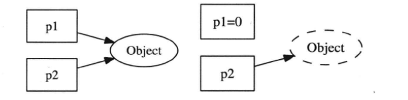
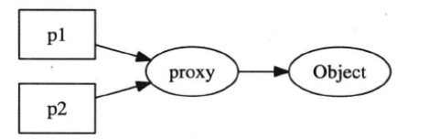

> 记录muduo库及多线程的一些要点，主要参考于陈硕《Linux多线程服务端编程》

#### 一  线程安全的对象生命期管理

##### 线程安全的定义

一个线程安全的类应大致满足一下三个条件：

1. 多个线程同时访问时，其表现出正确的行为

2. 无论操作系统如何调度这些线程，无论这些线程的执行顺序如何交织

3. 调用端代码无须额外的同步或其他协调动作

使用**同步原语**保护内部状态编写单个的线程安全类：

```C++
class ThreadsafeCounter {
	mutable std::mutex m; // “ M&M 规则”： mutable 与 mutex 一并出场
	int data = 0;
public:
	int get() const {
		std::lock_guard<std::mutex> lk(m);
		return data;
	}
	void inc() {
		std::lock_guard<std::mutex> lk(m);
		++data;
	}
}
```

##### 对象的构造

线程安全要求在构造期间不泄露this指针，原因在于如果构造期间如果对象没有完成初始化而泄漏给其他对象

1. 不要在构造函数中注册回调
2. 不要再构造函数中把this传给跨线程的对象

##### 对象的析构

mutex在析构时的局限性：作为成员的互斥器本身必须是有效的，而析构函数将破坏了这一假设，它会把mutex成员变量销毁掉。因此作为数据成员的mutex 不能保护析构。析构过程本身也不需要保护，因为只有别的线程都访问不到这个对象时，析构才是安全的。

##### 空悬指针问题

当指针暴露给别的线程是，指向对象的原始指针往往是不可靠的。



空悬指针式一种典型的内存错误。解决空悬指针的办法是引入一层间接性，让指针所指的对象永久有效。



但安全释放object又是一个问题。解决办法是是引入引用计数，整数计数型智能指针shared_ptr/weak_ptr。

关于shared_ptr / weak_ptr 的有关说明，在[cppreference](https://zh.cppreference.com/w/cpp/memory/shared_ptr)均有较为详细的说明。简而言之，shared_ptr控制对象的生命期，它是强引用，只要对象存在指向它的shared_ptr存在，该对象就不会被销毁。使用weak_ptr探查对象的生死。

shared_ptr实现线程安全的对象释放，但其shared_ptr本身不是100线程安全的。

#### 二  线程同步

##### 四项原则

1. 尽量最低限度地共享对象，减少需要同步的场合
2. 使用高级的并发编程构件，如TaskQueue
3. 不得已使用底层同步原语（primitives）时，只用非递归的互斥器和条件变量，慎用读写锁，不要用信号量
4. 除了使用atomic整数之外，不自己编写lock-free代码，也不要用内核级同步原语。

##### 互斥器

互斥器是使用最多的同步原语，它保护了临界区，任何一个时刻最多只能有一个线程在此mutex划出的临界区内活动。使用互斥器时要注意以下几点：

1. 使用RAII封装mutex的创建、销毁、加锁、解锁四个操作。
2. 只用非递归的mutex
3. 不手工调用lock和unlock函数，一切交给栈上的Guard对象的构造和析构函数负责

##### 条件变量 

我们总是希望加锁不要阻塞，总能立刻拿到锁，然后尽快访问数据，用完之后尽快解锁。

条件变量即一个或多个线程等待某个布尔表达式为真，即等待别的线程唤醒它。

作者花了大量篇幅介绍如何正确使用mutex和condition variable，但并不鼓励到处使用它们。这两者是非常底层的同步原语，主要用来实现更高级的并发编程工具。一个多线程程序里如果大量使用mutex和 condition
variable来同步，基本跟用铅笔刀锯大树没啥区别。

#### 三  多线程服务器适用场合与常用编程模型

多线程的特点是共享地址空间，从而高效地共享数据。多线程的价值是能够更好地发挥多核处理器的效能。

##### 单线程服务器的常用编程模型

在高性能的网络程序中，使用得最为广泛的是 non-blocking IO + IO multiplexing 即[Reactor](https://www.cnblogs.com/doit8791/p/7461479.html)模式。

在这种模型下，程序的基本结构是一个事件循环(event loop)以及事件驱动(event-driven)和事件回调的方式实现业务逻辑。可以参考一下 [lighttpd](http://www.lighttpd.net/)

Reactor模型的优点是编程不难，效率也不错；

基于事件驱动的编程模型本质的缺点是要求事件回调函数必须是非阻塞的，对于涉及网络IO的请求响应式协议，容易割裂业务逻辑，使其散布于多个回调函数之中，相对不容易理解和维护。

##### **多线程服务器的常用编程模型**

1. 每个请求创建一个线程，使用阻塞式IO操作
2. 使用线程池，同样使用阻塞式IO操作
3. non-blocking IO + one loop per      thread
4. leader / follower 等高级模式

one loop per thread，此种模式下，程序里的每个IO线程有一个event loop，用于处理读写和定时事件（无论周期性的还是单次的）eventloop代表了线程的主循环，需要让哪个线程干活，就把timer或io channel（如tcp 连接）注册到哪个线程的loop里即可。

推荐的c++多线程服务端编程模式是**one event loop per thread + thread pool** 

1. event loop 用作IO multiplexing 配合non-blocking IO和 定时器
2. thread pool 用来计算，具体可以是任务队列或生产者消费者队列

##### 进程间通信使用TCP

最大的好处在于可以跨主机，具有伸缩性。

TCP sockets和pipe都是操作文件描述符，用来收发字节流，都可以read/write/fcntl/select/poll等，但TCP是双向的，而linux的pipe是单向的，因此进程间双向通信还得开两个文件描述符，而且还要求进程要有父子关系，进一步限制了pipe的使用。

优点: TCP port由单一进程独占，并且在进程结束时文件描述符会被操作系统自动回收，不会给系统留下垃圾。TCP协议的另一好处的可记录和可重现。

##### 需要使用单线程的场合

需要fork，虽然多线程的程序也能fork，但那会遇到很多麻烦。

程序fork后一般有两种行为:

1. 立即执行exec()，转化为另一个程序。
2. 不调用exec(),继续运行当前程序。要么通过共享的文件描述符与父进程通信，协同完成任务，要么接过父进程传来的文件描述符。

单线程程序能限制程序的CPU占用率。

