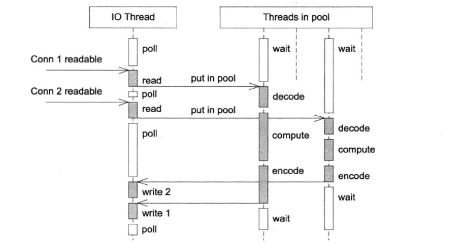
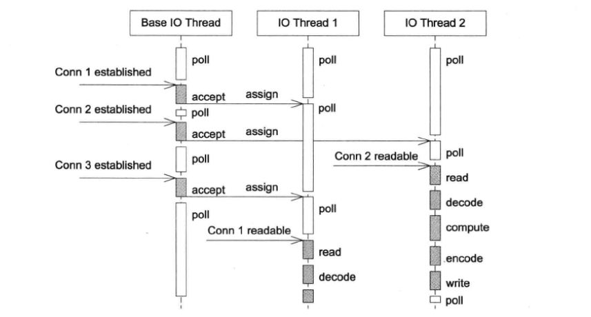
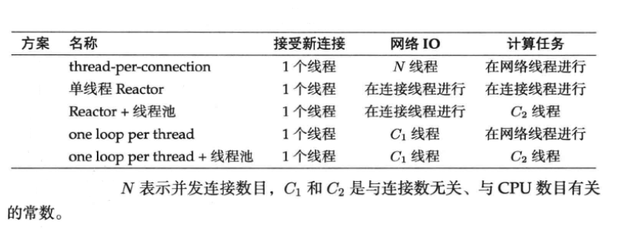

> 记录muduo库及多线程的一些要点，主要参考于陈硕《Linux多线程服务端编程》

#### 一  线程安全的对象生命期管理

##### 线程安全的定义

一个线程安全的类应大致满足一下三个条件：

1. 多个线程同时访问时，其表现出正确的行为

2. 无论操作系统如何调度这些线程，无论这些线程的执行顺序如何交织

3. 调用端代码无须额外的同步或其他协调动作

使用**同步原语**保护内部状态编写单个的线程安全类：

```C++
class ThreadsafeCounter {
	mutable std::mutex m; // “ M&M 规则”： mutable 与 mutex 一并出场
	int data = 0;
public:
	int get() const {
		std::lock_guard<std::mutex> lk(m);
		return data;
	}
	void inc() {
		std::lock_guard<std::mutex> lk(m);
		++data;
	}
}
```

##### 对象的构造

线程安全要求在构造期间不泄露this指针，原因在于如果构造期间如果对象没有完成初始化而泄漏给其他对象

1. 不要在构造函数中注册回调
2. 不要再构造函数中把this传给跨线程的对象

##### 对象的析构

mutex在析构时的局限性：作为成员的互斥器本身必须是有效的，而析构函数将破坏了这一假设，它会把mutex成员变量销毁掉。因此作为数据成员的mutex 不能保护析构。析构过程本身也不需要保护，因为只有别的线程都访问不到这个对象时，析构才是安全的。

##### 空悬指针问题

当指针暴露给别的线程是，指向对象的原始指针往往是不可靠的。


空悬指针式一种典型的内存错误。解决空悬指针的办法是引入一层间接性，让指针所指的对象永久有效。


但安全释放object又是一个问题。解决办法是是引入引用计数，整数计数型智能指针shared_ptr/weak_ptr。

关于shared_ptr / weak_ptr 的有关说明，在[cppreference](https://zh.cppreference.com/w/cpp/memory/shared_ptr)均有较为详细的说明。简而言之，shared_ptr控制对象的生命期，它是强引用，只要对象存在指向它的shared_ptr存在，该对象就不会被销毁。使用weak_ptr探查对象的生死。

shared_ptr实现线程安全的对象释放，但其shared_ptr本身不是100线程安全的。

#### 二  线程同步

##### 四项原则

1. 尽量最低限度地共享对象，减少需要同步的场合
2. 使用高级的并发编程构件，如TaskQueue
3. 不得已使用底层同步原语（primitives）时，只用非递归的互斥器和条件变量，慎用读写锁，不要用信号量
4. 除了使用atomic整数之外，不自己编写lock-free代码，也不要用内核级同步原语。

##### 互斥器

互斥器是使用最多的同步原语，它保护了临界区，任何一个时刻最多只能有一个线程在此mutex划出的临界区内活动。使用互斥器时要注意以下几点：

1. 使用RAII封装mutex的创建、销毁、加锁、解锁四个操作。
2. 只用非递归的mutex
3. 不手工调用lock和unlock函数，一切交给栈上的Guard对象的构造和析构函数负责

##### 条件变量 

我们总是希望加锁不要阻塞，总能立刻拿到锁，然后尽快访问数据，用完之后尽快解锁。

条件变量即一个或多个线程等待某个布尔表达式为真，即等待别的线程唤醒它。

作者花了大量篇幅介绍如何正确使用mutex和condition variable，但并不鼓励到处使用它们。这两者是非常底层的同步原语，主要用来实现更高级的并发编程工具。一个多线程程序里如果大量使用mutex和 condition
variable来同步，基本跟用铅笔刀锯大树没啥区别。

#### 三  多线程服务器适用场合与常用编程模型

多线程的特点是共享地址空间，从而高效地共享数据。多线程的价值是能够更好地发挥多核处理器的效能。

##### 单线程服务器的常用编程模型

在高性能的网络程序中，使用得最为广泛的是 non-blocking IO + IO multiplexing 即[Reactor](https://www.cnblogs.com/doit8791/p/7461479.html)模式。

在这种模型下，程序的基本结构是一个事件循环(event loop)以及事件驱动(event-driven)和事件回调的方式实现业务逻辑。可以参考一下 [lighttpd](http://www.lighttpd.net/)

Reactor模型的优点是编程不难，效率也不错；

基于事件驱动的编程模型本质的缺点是要求事件回调函数必须是非阻塞的，对于涉及网络IO的请求响应式协议，容易割裂业务逻辑，使其散布于多个回调函数之中，相对不容易理解和维护。

##### **多线程服务器的常用编程模型**

1. 每个请求创建一个线程，使用阻塞式IO操作
2. 使用线程池，同样使用阻塞式IO操作
3. non-blocking IO + one loop per      thread
4. leader / follower 等高级模式

one loop per thread，此种模式下，程序里的每个IO线程有一个event loop，用于处理读写和定时事件（无论周期性的还是单次的）eventloop代表了线程的主循环，需要让哪个线程干活，就把timer或io channel（如tcp 连接）注册到哪个线程的loop里即可。

推荐的c++多线程服务端编程模式是**one event loop per thread + thread pool** 

1. event loop 用作IO multiplexing 配合non-blocking IO和 定时器
2. thread pool 用来计算，具体可以是任务队列或生产者消费者队列

##### 进程间通信使用TCP

最大的好处在于可以跨主机，具有伸缩性。

TCP sockets和pipe都是操作文件描述符，用来收发字节流，都可以read/write/fcntl/select/poll等，但TCP是双向的，而linux的pipe是单向的，因此进程间双向通信还得开两个文件描述符，而且还要求进程要有父子关系，进一步限制了pipe的使用。

优点: TCP port由单一进程独占，并且在进程结束时文件描述符会被操作系统自动回收，不会给系统留下垃圾。TCP协议的另一好处的可记录和可重现。

##### 需要使用单线程的场合

需要fork，虽然多线程的程序也能fork，但那会遇到很多麻烦。

程序fork后一般有两种行为:

1. 立即执行exec()，转化为另一个程序。
2. 不调用exec(),继续运行当前程序。要么通过共享的文件描述符与父进程通信，协同完成任务，要么接过父进程传来的文件描述符。

单线程程序能限制程序的CPU占用率。

#### 四  c++多线程系统编程

多线程程序的正确性不能依赖于任何一个线程的执行速度，不能通过原地等待（sleep()）来假定其他线程的事件已经发生，而必须通过适当的同步来让当前线程能看到其他线程的事件的结果。

Linux上的线程标识：虽然POSIX threads库提供了pthread_self函数用于返回当前进程的标识符，但为了方便，一般建议用gettid系统调用的返回值作为线程id。

##### 线程的创建与销毁守则

- 程序库不应该在未提前告知的情况下创建自己的背景线程
- 尽量使用相同的方式创建线程
- 在进入main之前不应该启动线程
- 程序中线程的创建最好能在初始化阶段全部完成。

线程正常退出的方式只有一种，即自然死亡，从线程主函数返回，线程正常退出

exit在c++种不是线程安全的，它除了终止进程，还会析构全局对象和已经构造完的函数静态对象，这有潜在的死锁可能。

##### 多线程与IO

操作文件描述符的系统调用本身是线程安全的，不用担心多个线程同时操作文件描述符会造成进程崩溃或内核崩溃。多个线程同时操作同一个socket文件描述符仍是一件得不偿失的事。

原则：**每个文件描述符只由一个线程操作**，从而解决消息收发的顺序性问题，避免了关闭文件描述符的各种race condition.同时使用RAII包装文件描述符。

##### 多线程与fork()

一般不要在多线程程序种使用fork()，因为Linux的fork()只克隆当前线程的thread of control，不克隆其他线程，fork()之后，除了当前线程之王，其他线程都消失了。唯一安全的做法是在fork之后立即调用exec()执行另一个程序，彻底隔断子进程与父进程的联系。同时，在多线程程序中不要使用signal。

#### 五 日志库

在服务端编程中，日志是必不可少的，在生产环境中应该做到"log everything all the time"

对于关键进程，日志通常需要记录：

1. 收到的每条内部消息的id
2. 收到的每条外部消息的全文
3. 发出的每条消息的全文，每条消息都有全局唯一的id
4. 关键内部状态的变更，等等
5. 需要时间戳

##### 多线程异步日志

线程安全的日志，多个线程可以并发写日志，两个线程的日志消息不会出现交织。非阻塞日志是必须的，在网络IO线程或业务线程中直接往磁盘写数据的化，写操作偶尔可能阻塞长达数秒之久。

通常采用双缓冲计数，前端往buffer A填数据，后端将buffer B的数据写入文件。当buffer A 写满之后，交换A和B，如此往复。

#### 六 muduo

##### 线程模式

muduo采用的线程模型是**one loop per thread + thread pool**模型，每个线程最多有一个EventLoop，每个TcpConnection必须归某个EventLoop管理，所有的IO会转移到这个线程。即，一个文件描述符只能由一个线程读写，tcp连接所在的线程由其所属的eventloop决定，这样可以方便地把不同的tcp连接放到不同的线程去，也可以把一些tcp连接放到一个线程里。

##### TCP网络编程本质论

基于事件的非阻塞网络编程是编写高性能并发网络服务程序的主流模式。

最本质的是处理三个半事件

1. 连接的建立，包括服务端接收（accept）新连接和客户端成功发起（connect）连接。连接一旦建立，客户端和服务端是对等的，可以自由收发数据
2. 连接的断开，主动断开（close、shutdown）和被动断开(read 返回0)
3. 消息到达，文件描述符可读，这是最为重要的一个事件，对它的处理方式决定了网络编程的风格（阻塞还是非阻塞，如何处理分包，应用层的缓冲设计等等）
4. 消息发送完毕后，算半个事件要求，在一些环境下可以不必关系这个事件。

##### 常见的并发网络服务程序设计方案

1. iterative服务器，一次只能服务一个客户，例如unp中的daytimeserver

   ```c
   int main(int argc, char **argv)
   {
   	int					listenfd, connfd;
   	struct sockaddr_in	servaddr;
   	char				buff[MAXLINE];
   	time_t				ticks;
   
   	listenfd = Socket(AF_INET, SOCK_STREAM, 0);
   
   	bzero(&servaddr, sizeof(servaddr));
   	servaddr.sin_family      = AF_INET;
   	servaddr.sin_addr.s_addr = htonl(INADDR_ANY);
   	servaddr.sin_port        = htons(13);	/* daytime server */
   
   	Bind(listenfd, (SA *) &servaddr, sizeof(servaddr));
   
   	Listen(listenfd, LISTENQ);
   
   	for ( ; ; ) {
   		connfd = Accept(listenfd, (SA *) NULL, NULL);
           ticks = time(NULL);
           snprintf(buff, sizeof(buff), "%.24s\r\n", ctime(&ticks));
           Write(connfd, buff, strlen(buff));
   
   		Close(connfd);
   	}
   }
   ```

   

2. child-per-client 或 fork()-per-client，传统的Unix并发网络编程方案，这种方案适合并发连接数不大的情况以及计算响应的工作量远大于fork的开销的情况。适合长连接不太适合短连接。

   ```c
   int main(int argc, char **argv)
   {
   	int					listenfd, connfd;
   	pid_t				childpid;
   	socklen_t			clilen;
   	struct sockaddr_in	cliaddr, servaddr;
   	void				sig_chld(int);
   
   	listenfd = Socket(AF_INET, SOCK_STREAM, 0);
   
   	bzero(&servaddr, sizeof(servaddr));
   	servaddr.sin_family      = AF_INET;
   	servaddr.sin_addr.s_addr = htonl(INADDR_ANY);
   	servaddr.sin_port        = htons(SERV_PORT);
   
   	Bind(listenfd, (SA *) &servaddr, sizeof(servaddr));
   
   	Listen(listenfd, LISTENQ);
   
   	Signal(SIGCHLD, sig_chld);	/* must call waitpid() */
   
   	for ( ; ; ) {
   		clilen = sizeof(cliaddr);
   		if ( (connfd = accept(listenfd, (SA *) &cliaddr, &clilen)) < 0) {
   			if (errno == EINTR)
   				continue;		/* back to for() */
   			else
   				err_sys("accept error");
   		}
   
   		if ( (childpid = Fork()) == 0) {	/* child process */
   			Close(listenfd);	/* close listening socket */
   			str_echo(connfd);	/* process the request */
   			exit(0);
   		}
   		Close(connfd);			/* parent closes connected socket */
   	}
   }
   ```

3. 传统的java网络编程方案thread-per-connection，开销比上一种方案要小。但仍然不适合短链接服务。以上都是阻塞式网络编程，程序流程通常阻塞在read上，等待数据到达。当需要同时read和write时，一般有两种做法：使用两个线程/进程，一个负责读 一个负责写。

   另一种是使用IO multiplexing，也就是select/poll/epoll/kqueue，让其能处理多个链接。使用这些“多路选择器”需要配合非阻塞IO，而这就需要使用应用层buffer。

   ```c
   int main(int argc, char **argv)
   {
   	int					i, maxi, maxfd, listenfd, connfd, sockfd;
   	int					nready, client[FD_SETSIZE];
   	ssize_t				n;
   	fd_set				rset, allset;
   	char				buf[MAXLINE];
   	socklen_t			clilen;
   	struct sockaddr_in	cliaddr, servaddr;
   
   	listenfd = Socket(AF_INET, SOCK_STREAM, 0);
   
   	bzero(&servaddr, sizeof(servaddr));
   	servaddr.sin_family      = AF_INET;
   	servaddr.sin_addr.s_addr = htonl(INADDR_ANY);
   	servaddr.sin_port        = htons(SERV_PORT);
   
   	Bind(listenfd, (SA *) &servaddr, sizeof(servaddr));
   
   	Listen(listenfd, LISTENQ);
   
   	maxfd = listenfd;			/* initialize */
   	maxi = -1;					/* index into client[] array */
   	for (i = 0; i < FD_SETSIZE; i++)
   		client[i] = -1;			/* -1 indicates available entry */
   	FD_ZERO(&allset);
   	FD_SET(listenfd, &allset);
   
   	for ( ; ; ) {
   		rset = allset;		/* structure assignment */
   		nready = Select(maxfd+1, &rset, NULL, NULL, NULL);
   
   		if (FD_ISSET(listenfd, &rset)) {	/* new client connection */
   			clilen = sizeof(cliaddr);
   			connfd = Accept(listenfd, (SA *) &cliaddr, &clilen);
   #ifdef	NOTDEF
   			printf("new client: %s, port %d\n",
   					Inet_ntop(AF_INET, &cliaddr.sin_addr, 4, NULL),
   					ntohs(cliaddr.sin_port));
   #endif
   
   			for (i = 0; i < FD_SETSIZE; i++)
   				if (client[i] < 0) {
   					client[i] = connfd;	/* save descriptor */
   					break;
   				}
   			if (i == FD_SETSIZE)
   				err_quit("too many clients");
   
   			FD_SET(connfd, &allset);	/* add new descriptor to set */
   			if (connfd > maxfd)
   				maxfd = connfd;			/* for select */
   			if (i > maxi)
   				maxi = i;				/* max index in client[] array */
   
   			if (--nready <= 0)
   				continue;				/* no more readable descriptors */
   		}
   
   		for (i = 0; i <= maxi; i++) {	/* check all clients for data */
   			if ( (sockfd = client[i]) < 0)
   				continue;
   			if (FD_ISSET(sockfd, &rset)) {
   				if ( (n = Read(sockfd, buf, MAXLINE)) == 0) {
   						/*4connection closed by client */
   					Close(sockfd);
   					FD_CLR(sockfd, &allset);
   					client[i] = -1;
   				} else
   					Writen(sockfd, buf, n);
   
   				if (--nready <= 0)
   					break;				/* no more readable descriptors */
   			}
   		}
   	}
   }
   ```

4. 单线程的Reactor程序； 在没有事件的时候，线程等待在select/poll/epoll等函数上，事件到达后由网络库处理IO，再把消息通知客户端代码。由于只有一个线程，因此事件是顺序处理的。这种方案的优点是由网络库搞定数据收发，程序只关心业务逻辑；缺点是只适合IO密集的应用，不太适合CPU密集的应用。

5. 计算任务不在reactor线程计算，而是创建一个新线程去计算，以充分利用多核CPU，它为每个请求（不是每个连接）创建一个新线程，这个开销可以用线程池来避免。

6. 弥补为每个请求创建线程的缺陷，使用固定大小的线程池。IO工作在reactor线程完成，计算任务交给线程池。

   

7. muduo使用的多线程方案，特点是 one loop per thread ,有一个main reactor负责accept连接，然后把连接挂在某个sub reactor中，这样改连接的所有操作都在哪个sub reactor所处线程完成。通常线程数是固定的，线程池大小通常根据CPU数目来确定。
8. 减少进出thread pool的两次上下文切换，在把多个连接分散到多个reactor线程之后，小规模计算可以在当前IO线程完成并发挥结构，从而降低响应的延迟。



​	不同方案的一些对比：

